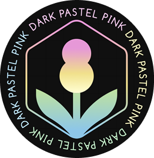

   

# Dark Pastel Pink Theme for VS Code 

A soothing dark theme for VS Code, blending soft pastel pinks with vibrant pastel shades for comfortable low-light coding.

## ✅📌 Installation via VS Code

1. Open the Extensions sidebar panel in VS Code. *View → Extensions* (or Ctrl+Shift+X / Cmd+Shift+X)
2. Search for "Dark Pastel Pink" (or the name you used in your `package.json`).
3. Click *Install* to install it.
4. Click *Reload* to reload the editor.
5. *Code > Preferences > Color Theme > Dark Pastel Pink*.

## ⬇️🚀 Manual Installation

1. Download the `.vsix` file from the [VS Code Marketplace](link-to-your-marketplace-page) or from the [Releases](link-to-your-github-releases) section of this repository.
2. In VS Code, open the Extensions view (Ctrl+Shift+X or Cmd+Shift+X).
3. Click the three dots (...) at the top right of the Extensions view.
4. Select "Install from VSIX..."
5. Choose the downloaded `.vsix` file.

## 🎨🖌️ Color Reference

This section provides a general overview of the colors used in the theme.  For a more detailed look, please refer to the theme's JSON file.

### Syntax Colors (Examples)

| Color             | Usage                                       |
|-------------------|---------------------------------------------|
| `#c3a6ff`         | Keywords, constants, template literals      |
| `#ffd580`         | Functions, classes, object literal keys     |
| `#ffae57`         | Constants, operators                        |
| `#bae67e`         | Strings, markdown headings                  |
| `#5ccfe6`         | Special keywords, classes, markdown code blocks |
| `#a2aabc`         | Variables, property names, tags             |

### UI Colors (Examples)

| Color             | Usage                                       |
|-------------------|---------------------------------------------|
| `#171c28`         | Workbench background                        |
| `#1d2433`         | Editor background                           |
| `#2f3b54`         | Highlight, widgets, panels                  |
| `#6679a4`         | Dividers, subtle UI elements                |
| `#8695b7`         | Status bar text, buttons, etc.              |
| `#d7dce2`         | Active text                                  |
| `#ffcc66`         | Accent, list tree titles, badges             |
| `#bae67e`         | Addition highlights                         |
| `#ef6b73`         | Deletion highlights, errors, warnings       |
| `#5ccfe6`         | Modified highlights                         |

## 💡🔍 Theming Reference

* [VS Code Theme Color Reference](https://code.visualstudio.com/api/references/theme-color)
* [VS Code Theme Documentation](https://code.visualstudio.com/api/extension-guides/color-themes)
* [VS Code Publishing Extensions](https://code.visualstudio.com/api/working-with-extensions/publishing-extensions)

